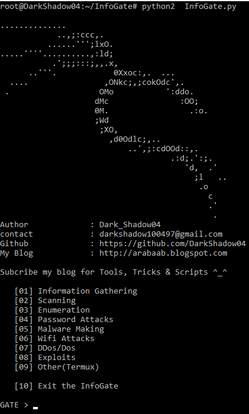

# InfoGate
InfoGate consists of working useful tools that comes under category of Ethical Hacking

## Screenshot


### Requirements
• Python 2.x

#### Installation and Using Darktool
```
git clone https://github.com/DarkShadow04/InfoGate
```
```
cd InfoGate
```
```
chmod +x InfoGate.py
```
```
python2 InfoGate.py
```


<h2> No longer maintained</h2>
<p> no time to finish up, will make new one from scratch </p>
